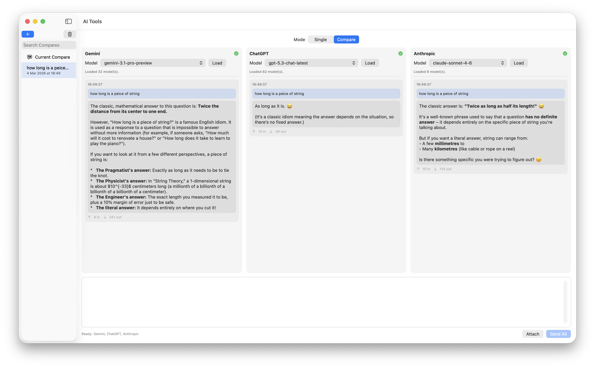

# AI Compare

A SwiftUI AI compare playground for chatting with Gemini, OpenAI, Anthropic, and Grok from one interface, in either single-chat or side-by-side compare mode.

## Download

[](https://github.com/brainfuel/AI-Tools/releases/latest)

[Download the latest macOS build](https://github.com/brainfuel/AI-Tools/releases/latest)

## Screenshots




## Overview

AI Compare lets you:

- switch between Gemini, OpenAI, Anthropic, and Grok
- run in `Single` mode for normal chat or `Compare` mode for side-by-side provider comparison
- load and cache available models per provider
- keep local history with searchable threads
- send prompts with optional attachments
- view and save generated media (images, audio, video, PDF, text, JSON, CSV)

## Features

- Unified chat UI across providers
- Segmented `Single` / `Compare` workspace modes
- Provider-specific API keys in Keychain
- Provider + selected model saved per conversation
- Mode-aware sidebar with new/delete/search and separate single/compare thread lists
- Markdown rendering for assistant responses
- Cached model lists per provider (instant when switching chats/providers)
- Startup model prefetch for providers that already have API keys
- Attachment import with image preprocessing (center-crop to square, resize up to 1280x1280, JPEG encode)
- 18 MB attachment size limit per file
- Media output viewer with Save export flow
- Token usage rows per response plus usage stats sheet (session, 24h, 7d, 30d)

## Provider Support

| Provider | Chat | Model List | Attachments | Media Output |
|---|---|---|---|---|
| Gemini | Yes | Yes | Yes | Yes |
| OpenAI | Yes | Yes | Images supported (non-image files skipped) | Image generation models supported |
| Anthropic | Yes | Yes | Images supported (non-image files skipped) | Text only |
| Grok | Yes | Yes | Images supported (non-image files skipped) | Text only |

Notes:

- OpenAI image generation is used automatically when an image model ID is selected (for example `gpt-image-*` or `dall-e-*`).
- Compare mode sends the same prompt/attachments to all ready providers (API key + selected model).

## Requirements

- Xcode 17+
- Apple platform SDKs supported by your local Xcode install
- Valid API key(s) for any provider you want to use

The current project settings in `AI Tools.xcodeproj` target the latest SDK versions configured in the project file.

## Getting Started

1. Clone this repository.
2. Open [AI Tools.xcodeproj](AI%20Tools.xcodeproj) in Xcode.
3. Select the `AI Tools` scheme.
4. Choose a run destination (for example `My Mac`).
5. Build and run.

CLI build example:

```bash
xcodebuild -project "AI Tools.xcodeproj" -scheme "AI Tools" -configuration Debug build
```

## Usage

1. Choose `Single` or `Compare` at the top of the detail view.
2. In `Single`, select a provider in **Connection** and paste the provider API key.
3. Click **Load Models** (optional) and pick a model from **Available Models**.
4. Type a prompt, optionally attach files, then click **Send**.
5. Click the chart icon in the top-right toolbar for usage/cost stats.
6. In `Compare`, pick model(s) per provider column, then use **Send All** to run one prompt across providers side-by-side.
7. Use the left sidebar to reopen threads; it automatically shows single threads in `Single` mode and compare threads in `Compare` mode.

## Data Storage

- API keys are stored securely in the system Keychain.
- Single-chat conversations are stored locally with SwiftData.
- Compare-mode conversations are stored locally with SwiftData.
- Model selections and model-list caches are stored locally with `@AppStorage`.
- Generated media is written to a local Application Support folder and referenced from SwiftData records.
- No server-side app backend is included in this project.

## Testing

This project includes unit tests for `PlaygroundViewModel` and request-body behavior, including:

- cached models shown immediately when switching conversations/providers
- startup model prefetch behavior
- one-time launch prefetch guard
- rolling token/cost aggregation (24h/7d/30d), including legacy timestamp fallback and unsaved current-chat data
- OpenAI image attachment encoding in chat request bodies

Run tests:

```bash
xcodebuild -project "AI Tools.xcodeproj" -scheme "AI Tools" -destination "platform=macOS" -configuration Debug CODE_SIGNING_ALLOWED=NO CODE_SIGNING_REQUIRED=NO test
```

## Project Structure

**Entry point**
- [AI Tools/AI_ToolsApp.swift](AI%20Tools/AI_ToolsApp.swift): App entry point, `ModelContainer` setup, service and view model wiring

**Views**
- [AI Tools/ContentView.swift](AI%20Tools/ContentView.swift): Root `NavigationSplitView` shell and workspace mode state
- [AI Tools/Views/ContentWorkspaceViews.swift](AI%20Tools/Views/ContentWorkspaceViews.swift): Sidebar, composer, attachment strip, and compare workspace views
- [AI Tools/Views/ChatRenderingViews.swift](AI%20Tools/Views/ChatRenderingViews.swift): Message and media rendering components

**View models**
- [AI Tools/ViewModels/PlaygroundViewModel.swift](AI%20Tools/ViewModels/PlaygroundViewModel.swift): Single-chat send flow, conversation loading, token tracking
- [AI Tools/ViewModels/CompareViewModel.swift](AI%20Tools/ViewModels/CompareViewModel.swift): Compare send flow, concurrent provider execution, compare history

**Services**
- [AI Tools/Services/APIKeyManager.swift](AI%20Tools/Services/APIKeyManager.swift): Keychain read/write with debounced persistence
- [AI Tools/Services/ModelService.swift](AI%20Tools/Services/ModelService.swift): Model selection and per-provider model list cache

**Storage**
- [AI Tools/Storage/SwiftDataModels.swift](AI%20Tools/Storage/SwiftDataModels.swift): `@Model` classes (`ConversationRecord`, `MessageRecord`, `CompareConversationRecord`, `CompareRunRecord`)
- [AI Tools/Storage/ConversationStore.swift](AI%20Tools/Storage/ConversationStore.swift): SwiftData-backed single-chat persistence, media normalization, JSON migration
- [AI Tools/Storage/CompareConversationStore.swift](AI%20Tools/Storage/CompareConversationStore.swift): SwiftData-backed compare persistence, media normalization, AppStorage migration

**Models**
- [AI Tools/Models/ChatModels.swift](AI%20Tools/Models/ChatModels.swift): Core data models and provider enums
- [AI Tools/Models/PendingAttachment.swift](AI%20Tools/Models/PendingAttachment.swift): Attachment loading and image preprocessing

**Networking**
- [AI Tools/Networking/GeminiClient.swift](AI%20Tools/Networking/GeminiClient.swift): Gemini API integration
- [AI Tools/Networking/OpenAIClient.swift](AI%20Tools/Networking/OpenAIClient.swift): OpenAI API integration
- [AI Tools/Networking/AnthropicClient.swift](AI%20Tools/Networking/AnthropicClient.swift): Anthropic API integration
- [AI Tools/Networking/GrokClient.swift](AI%20Tools/Networking/GrokClient.swift): xAI Grok API integration

**Tests**
- [AI ToolsTests/PlaygroundViewModelTests.swift](AI%20ToolsTests/PlaygroundViewModelTests.swift): Model cache, prefetch, and token aggregation unit tests
- [AI ToolsTests/ConversationStoreTests.swift](AI%20ToolsTests/ConversationStoreTests.swift): Conversation storage round-trip coverage

## Known Limitations

- OpenAI, Anthropic, and Grok currently send image attachments only; non-image attachments are skipped.
- Gemini and Anthropic currently return final responses (not token-by-token UI streaming).

## License

[MIT](LICENSE)
